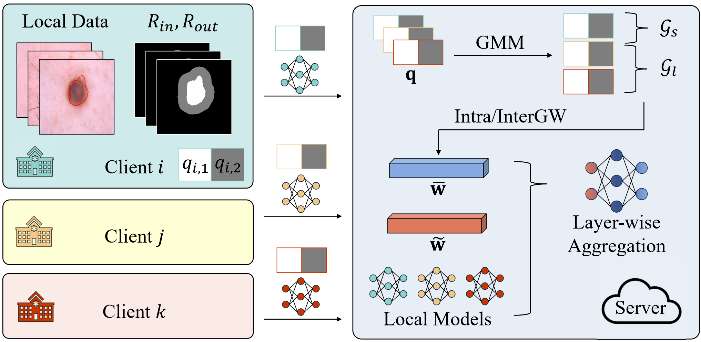

# FedAAAI

This is the official implementation for the paper: "[FedA3I: Annotation Quality-Aware Aggregation for Federated Medical Image Segmentation against Heterogeneous Annotation Noise](https://arxiv.org/abs/2312.12838)", which is accepted at `AAAI'24` main technical track.

<p align="center">
    
</p>


## Brief Introduction
In this paper, we pioneer the identification and formulation of a significant problem in federated learning (FL) for medical applications, *i.e.*, **how to perform robust FL for medical image segmentation against heterogeneous annotation noise**. This work is a classification-to-segmentation extension of our previous work ([FedNoRo](https://arxiv.org/abs/2305.05230)) on the federated noisy classification problem.

## Requirements
We recommend using conda to setup the environment. See the `requirements.txt` for environment configuration.

## Datasets Preparation
You can download the ISIC 2017 dataset [here](https://challenge.isic-archive.com/data/#2017). You can download the BREAST dataset [here](https://github.com/corcor27/BUS-Set). Please resize all images to $224 \times 224$. 

You should put all images and labels (ground truth) to specified directories, like the following example. 

```
└── data
    └── ISIC2017
        │
        ├── test
        │   ├── gt
        │   └── imgs
        └── train
            ├── gt
            └── imgs
```
If these datasets are used in your research, please cite the initial dataset papers.


## Noise Generation
An important contribution of this paper is the noise model (CEM and its multi-source form). We give a simple implementation in `data/ISIC2017/noise_generate.py` for ISIC 2017. 

😭😭😭 We apologize for the lack of organization in the code, which may result in some complexity. We will consider reorgenize it better in subsequent versions. If you have any questions please contact us and we will try to help. We also welcome someone with strong coding skills to work with us to achieve a better implementation of this noise model.

If the noisy annotations have been generated, remember to update `train_dataset` in `code/datasets/dataset.py`. You can refer to the following example.

```
train_dataset = ISIC2017Dataset(datapath="data/ISIC2017/train/imgs/", 
                                gtpath="data/ISIC2017/train/*THE FOLDER of NOISY ANNOTATION*/", 
                                mode="train", 
                                args=args)
```


## Run
You can conduct the experiment as following if everything is ready. 
```
python code/train_FedAAAI.py
```

## Citation
If this repository is useful for your research, please consider citing:
```
@inproceedings{wu2023feda3i,
  title={FedA3I: Annotation Quality-Aware Aggregation for Federated Medical Image Segmentation against Heterogeneous Annotation Noise},
  author={Wu, Nannan and Sun, Zhaobin and Yan, Zengqiang and Yu, Li},
  booktitle={AAAI},
  year={2024}
}
```

## Contact
For any questions, please contact 'wnn2000@hust.edu.cn'.

